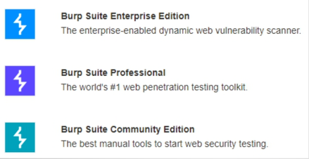
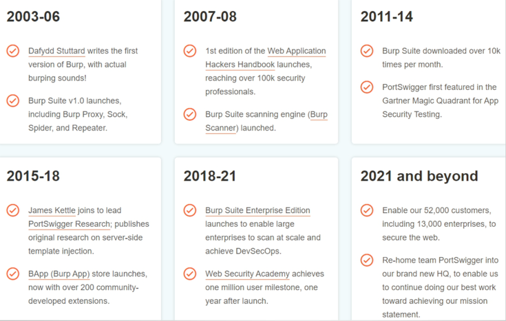

# BurpSuite_Learning

## Burp Suite基础介绍

### 发音的纠正

[bɜ:p] [swiːt]

Burp   Suite

### 官网介绍

官网地址：https://portswigger.net/

### 业界评价


### 三种版本



### 发展历史



### 主要产品

* Burp Suite
* 培训和认证(Academy) 
* 研究院(Research)
* 日报(Daily)

### 历史版本

获取地址：https://portswigger.net/burp/releases

* Burp Suite 1.7.33 
* Burp Suite 2020.2

### 主要功能

#### 目标

测试网站安全性

#### 手段

* 抓HTTP包；
* 改HTTP包；
* 自动请求；
* 过滤响应。

#### 场景

* SQL注入；
* 文件上传；
* XSS；
* CSRF；
* FUZZ；
* 重放；
* 攻击；
* 密码爆破；
* 爬取数据；
* 漏洞扫描。

### 特点

* 集成化；
* 自动化；
* 可扩展。

### 版本区别

* 企业版Enterprise Edition；
* 社区版Community Edition；
* 专业版Professional ($399/year)。

### 运行平台

* Jar(推荐)
* Linux
* MacOS(ARM、Intel) 
* Windows

### 参考资料

#### 本地文档

问号按钮

#### 在线文档

https://portswigger.net/support
https://portswigger.net/burp/documentation/desktop

#### 学院训练平台

https://portswigger.net/web-security

#### 问答社区

https://forum.portswigger.net/

## Burp Suite配置启动

### Burp Suite程序下载

#### Burp jar包

推荐2021+，jar包版本，下载地址：https://portswigger.net/burp/releases

#### JRE环境

##### JDK类型

推荐解压版(zip) 

##### JDK版本

推荐JDK11 (配合Burp 2021)

下载镜像：https://repo.huaweicloud.com/java/jdk/

#### JDK11环境变量配置

| 变量       | 值 |
|----------|---|
| JAVA_HOME | JDK解压的根路径 |
| PATH     | %JAVA_HOME%\bin  |

#### 激活和汉化包

激活软件下载地址: https://github.com/h3110w0r1d-y/BurpLoaderKeygen/releases

汉化包地址: https://github.com/h3110w0r1d-y/BurpLoaderKeygen/releases/download/2.0/BurpLoaderKeygenCn.jar

### Burp Suite启动激活

#### 命令行方式启动

burp_start.bat，内容：

``` bat
@echo off
cmd /k "java -jar BurpLoaderKeygen.jar"
```

#### VBS启动

```vbs
set ws=WScript.CreateObject("WScript.Shell")
ws.Run "burp_start.bat",0
```

### Burp Suite配置

#### 汉化说明

burp_cn_start.bat，内容为：

```bat
@echo off
cmd /k "java -jar BurpLoaderKeygenCn.jar"
```

#### 其他配置

* 字体大小；
* 汉字乱码。