# BurpSuite_Learning

## Burp Suite基础介绍

### 发音的纠正

[bɜ:p] [swiːt]

Burp   Suite

### 官网介绍

官网地址：https://portswigger.net/

### 业界评价


### 三种版本


### 发展历史


### 主要产品

* Burp Suite
* 培训和认证(Academy) 
* 研究院(Research)
* 日报(Daily)

### 历史版本

获取地址：https://portswigger.net/burp/releases

* Burp Suite 1.7.33 
* Burp Suite 2020.2

### 主要功能

#### 目标

测试网站安全性

#### 手段

* 抓HTTP包；
* 改HTTP包；
* 自动请求；
* 过滤响应。

#### 场景

* SQL注入；
* 文件上传；
* XSS；
* CSRF；
* FUZZ；
* 重放；
* 攻击；
* 密码爆破；
* 爬取数据；
* 漏洞扫描。

### 特点

* 集成化；
* 自动化；
* 可扩展。

### 版本区别

* 企业版Enterprise Edition；
* 社区版Community Edition；
* 专业版Professional ($399/year)。

### 运行平台

* Jar(推荐)
* Linux
* MacOS(ARM、Intel) 
* Windows

### 参考资料

#### 本地文档

问号按钮

#### 在线文档

https://portswigger.net/support
https://portswigger.net/burp/documentation/desktop

#### 学院训练平台

https://portswigger.net/web-security

#### 问答社区

https://forum.portswigger.net/

## Burp Suite配置启动

### Burp Suite程序下载

#### Burp jar包

推荐2021+，jar包版本，下载地址：https://portswigger.net/burp/releases

#### JRE环境

##### JDK类型

推荐解压版(zip) 

##### JDK版本

推荐JDK11 (配合Burp 2021)

下载镜像：https://repo.huaweicloud.com/java/jdk/

#### JDK11环境变量配置

| 变量       | 值 |
|----------|---|
| JAVA_HOME | JDK解压的根路径 |
| PATH     | %JAVA_HOME%\bin  |

#### 激活和汉化包

激活软件下载地址: https://github.com/h3110w0r1d-y/BurpLoaderKeygen/releases

汉化包地址: https://github.com/h3110w0r1d-y/BurpLoaderKeygen/releases/download/2.0/BurpLoaderKeygenCn.jar

### Burp Suite启动激活

#### 命令行方式启动

burp_start.bat，内容：

``` bat
@echo off
cmd /k "java -jar BurpLoaderKeygen.jar"
```

#### VBS启动

```vbs
set ws=WScript.CreateObject("WScript.Shell")
ws.Run "burp_start.bat",0
```

### Burp Suite配置

#### 汉化说明

burp_cn_start.bat，内容为：

```bat
@echo off
cmd /k "java -jar BurpLoaderKeygenCn.jar"
```

#### 其他配置

* 字体大小；
* 汉字乱码。

## Burp Suite模块详解

### Burp Suite界面布局

参考手册：https://portswigger.net/burp/documentation/contents

#### 界面总览

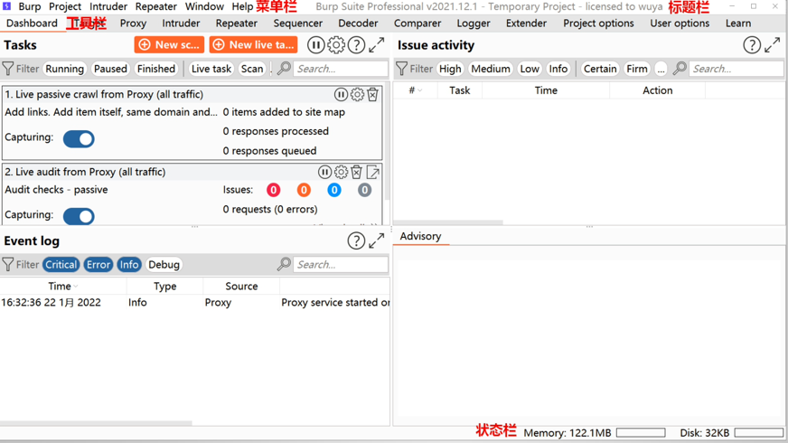

#### 旧版对比

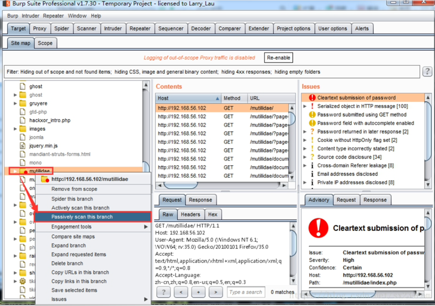

### Burp Suite菜单栏

#### Burp

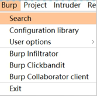

1. 搜索内容；
2. 配置库；
3. 用户选项；
4. Infiltrator；
5. Clickbandit；
6. Collaborator client。

#### Project

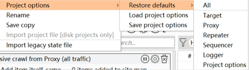

1. 工程配置；
2. 重命名；
3. 保存备份；
4. 导入配置；
5. 导入遗留状态文件。

#### Intruder

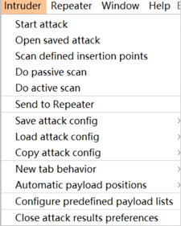

1. 发起攻击；
2. 打开工作空间；
3. 扫描预定义的插入点；
4. 被动扫描；
5. 主动扫描；
6. 发送到Repeater；
7. 保存、加载、复制配置；
8. 打开新标签时的操作；
9. 自动标记payload位置；
10. 配置预定义字典；
11. 关闭攻击结果时的偏好。

#### Repeater

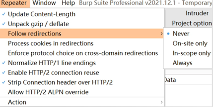

1. 更新Content-Length；
2. 解压压缩的数据；
3. 跟随重定向跳转；
4. 重定向的cookie处理；
5. 跨域跳转；
6. HTTP1行结尾；
7. HTTP2连接重用；
8. 剥离HTTP2连接头；
9. 允许HTTP2 ALPN覆盖。

补充官方文档：https://portswigger.net/burp/documentation/desktop/tools/repeater/options

#### Window

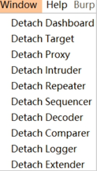

剥离XXX窗口

#### Help

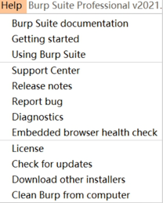

1. 离线文档；
2. 上手；
3. 用BP做渗透测试；
4. 支持中心(在线)；
5. 更新记录；
6. 上报bug；
7. 运行诊断；
8. 内置浏览器健康检查；
9. 许可证；
10. 检查更新；
11. 下载其他安装器；
12. 删除BP。

### 模块总体介绍

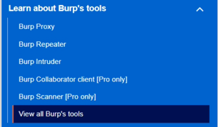

官方文档：https://portswigger.net/burp/documentation/desktop/tools

#### 仪表盘--Dashbord

* 扫描；
* 任务Tasks；
* 事件日志Event Log；
* 漏洞问题Issue activity。

官方文档：https://portswigger.net/burp/documentation/desktop/dashboard

#### 目标模块--Target

* 生成站点地图(sitemap)；
* 设置扫描域(target scope)；
* 生成安全分析。

#### 代理模块--Proxy

拦截浏览器的HTTP数据包(包括请求和响应)。

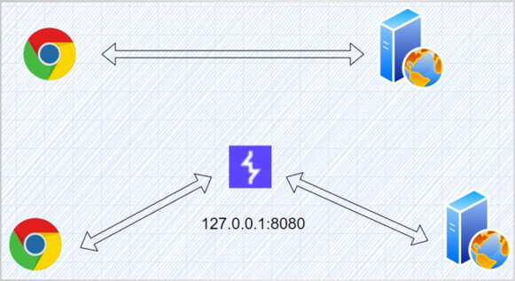

#### 渗透模块--Intruder

对拦截到的请求(地址)，设置攻击载荷 (payload)，利用字典进行渗透测试，比如：

* 目录扫描；
* 密码暴力破解；
* 压力测试；
* FUZZ等等。

#### 重放模块--Repeater

1. 分析每一步具体的请求和响应内容；
2. 修改请求和响应内容；
3. 重发请求内容。

#### 序列器模块--Sequencer

用来评估Token、Session等关键字段是否可以伪造(是否固定、是否可预测)。

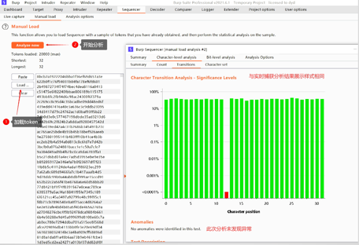

#### 解码器模块--Decoder

对请求数据进行编码、解码。

类型：

URL；
HTML；
Base64；
ASCII hex；
Hex；
Octal；
Binary；
Gzip。

算法：

SHA；
SHA-1；
SHA-224；
SHA-256；
SHA-384；
SHA-512；
SHA-512/224；
SHA-512/256；
SHA3-224。

#### 比较器模块--Comparer

对两次请求的结果进行对比。

#### 扩展模块--Extender

对插件进行管理。


