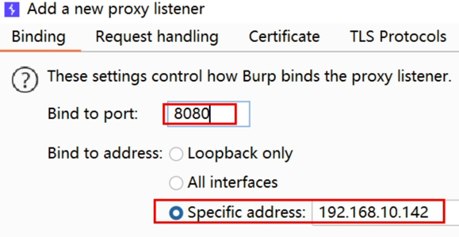
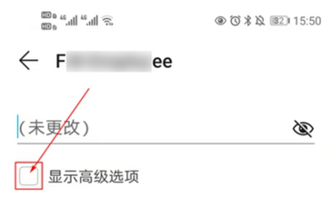

# BurpSuite_Learning

## Burp Suite基础介绍

### 发音的纠正

[bɜ:p] [swiːt]

Burp   Suite

### 官网介绍

官网地址：https://portswigger.net/

### 业界评价


### 三种版本


### 发展历史


### 主要产品

* Burp Suite
* 培训和认证(Academy) 
* 研究院(Research)
* 日报(Daily)

### 历史版本

获取地址：https://portswigger.net/burp/releases

* Burp Suite 1.7.33 
* Burp Suite 2020.2

### 主要功能

#### 目标

测试网站安全性

#### 手段

* 抓HTTP包；
* 改HTTP包；
* 自动请求；
* 过滤响应。

#### 场景

* SQL注入；
* 文件上传；
* XSS；
* CSRF；
* FUZZ；
* 重放；
* 攻击；
* 密码爆破；
* 爬取数据；
* 漏洞扫描。

### 特点

* 集成化；
* 自动化；
* 可扩展。

### 版本区别

* 企业版Enterprise Edition；
* 社区版Community Edition；
* 专业版Professional ($399/year)。

### 运行平台

* Jar(推荐)
* Linux
* MacOS(ARM、Intel) 
* Windows

### 参考资料

#### 本地文档

问号按钮

#### 在线文档

https://portswigger.net/support
https://portswigger.net/burp/documentation/desktop

#### 学院训练平台

https://portswigger.net/web-security

#### 问答社区

https://forum.portswigger.net/

## Burp Suite配置启动

### Burp Suite程序下载

#### Burp jar包

推荐2021+，jar包版本，下载地址：https://portswigger.net/burp/releases

#### JRE环境

##### JDK类型

推荐解压版(zip) 

##### JDK版本

推荐JDK11 (配合Burp 2021)

下载镜像：https://repo.huaweicloud.com/java/jdk/

#### JDK11环境变量配置

| 变量       | 值 |
|----------|---|
| JAVA_HOME | JDK解压的根路径 |
| PATH     | %JAVA_HOME%\bin  |

#### 激活和汉化包

激活软件下载地址: https://github.com/h3110w0r1d-y/BurpLoaderKeygen/releases

汉化包地址: https://github.com/h3110w0r1d-y/BurpLoaderKeygen/releases/download/2.0/BurpLoaderKeygenCn.jar

### Burp Suite启动激活

#### 命令行方式启动

burp_start.bat，内容：

``` bat
@echo off
cmd /k "java -jar BurpLoaderKeygen.jar"
```

#### VBS启动

```vbs
set ws=WScript.CreateObject("WScript.Shell")
ws.Run "burp_start.bat",0
```

### Burp Suite配置

#### 汉化说明

burp_cn_start.bat，内容为：

```bat
@echo off
cmd /k "java -jar BurpLoaderKeygenCn.jar"
```

#### 其他配置

* 字体大小；
* 汉字乱码。

## Burp Suite模块详解

### Burp Suite界面布局

参考手册：https://portswigger.net/burp/documentation/contents

#### 界面总览


#### 旧版对比


### Burp Suite菜单栏

#### Burp


1. 搜索内容；
2. 配置库；
3. 用户选项；
4. Infiltrator；
5. Clickbandit；
6. Collaborator client。

#### Project


1. 工程配置；
2. 重命名；
3. 保存备份；
4. 导入配置；
5. 导入遗留状态文件。

#### Intruder


1. 发起攻击；
2. 打开工作空间；
3. 扫描预定义的插入点；
4. 被动扫描；
5. 主动扫描；
6. 发送到Repeater；
7. 保存、加载、复制配置；
8. 打开新标签时的操作；
9. 自动标记payload位置；
10. 配置预定义字典；
11. 关闭攻击结果时的偏好。

#### Repeater


1. 更新Content-Length；
2. 解压压缩的数据；
3. 跟随重定向跳转；
4. 重定向的cookie处理；
5. 跨域跳转；
6. HTTP1行结尾；
7. HTTP2连接重用；
8. 剥离HTTP2连接头；
9. 允许HTTP2 ALPN覆盖。

补充官方文档：https://portswigger.net/burp/documentation/desktop/tools/repeater/options

#### Window


剥离XXX窗口

#### Help


1. 离线文档；
2. 上手；
3. 用BP做渗透测试；
4. 支持中心(在线)；
5. 更新记录；
6. 上报bug；
7. 运行诊断；
8. 内置浏览器健康检查；
9. 许可证；
10. 检查更新；
11. 下载其他安装器；
12. 删除BP。

### 模块总体介绍


官方文档：https://portswigger.net/burp/documentation/desktop/tools

#### 仪表盘--Dashbord

* 扫描；
* 任务Tasks；
* 事件日志Event Log；
* 漏洞问题Issue activity。

官方文档：https://portswigger.net/burp/documentation/desktop/dashboard

#### 目标模块--Target

* 生成站点地图(sitemap)；
* 设置扫描域(target scope)；
* 生成安全分析。

#### 代理模块--Proxy

拦截浏览器的HTTP数据包(包括请求和响应)。


#### 渗透模块--Intruder

对拦截到的请求(地址)，设置攻击载荷 (payload)，利用字典进行渗透测试，比如：

* 目录扫描；
* 密码暴力破解；
* 压力测试；
* FUZZ等等。

#### 重放模块--Repeater

1. 分析每一步具体的请求和响应内容；
2. 修改请求和响应内容；
3. 重发请求内容。

#### 序列器模块--Sequencer

用来评估Token、Session等关键字段是否可以伪造(是否固定、是否可预测)。


#### 解码器模块--Decoder

对请求数据进行编码、解码。

类型：

URL；
HTML；
Base64；
ASCII hex；
Hex；
Octal；
Binary；
Gzip。

算法：

SHA；
SHA-1；
SHA-224；
SHA-256；
SHA-384；
SHA-512；
SHA-512/224；
SHA-512/256；
SHA3-224。

#### 比较器模块--Comparer

对两次请求的结果进行对比。

#### 扩展模块--Extender

对插件进行管理。

## Burp Proxy模块

1. 浏览器代理设置；
2. Burp Suite代理设置；
3. Burp Suite拦截HTTPS数据；
4. Burp Suite拦截手机App数据。

### 网络代理


### 网络代理的作用

* 突破IP限制；
* 隐藏IP；
* 加速访问；
* 等等。

### Burp代理的作用

拦截HTTP(S)请求，并对请求和响应进行处理和利用。

### 与Fiddler、WireShark的区别

| 对比项 | Burp  | Fiddler  | WireShark |
|-----|---|----------|---|
| 平台  | 多平台  | Windows  | 多平台 |
| 定位  | 渗透测试套件  | Web调试工具  | 网络封包分析工具 |
| 功能  | 渗透测试  | 调试HTTP请求 | 分析数据帧 |

### 浏览器代理设置


### Burp代理设置

#### Intercept

| 操作   | 描述  |
|-------|---|
| Forward | 放行本次拦截的包，发送到服务器  |
| Drop  | 丢弃本次拦截的包  |
| on/off      | 拦截开关  |
| Action      | 对数据的操作  |
| Open in Browser      | 打开内置浏览器  |

#### Options选项(详细设置)

| 操作  | 描述  |
|---|---|
| Proxy Listeners  | 监听器  |
| Intercept Client Requests  | 请求拦截规则  |
| Intercept Server Response  | 响应拦截规则  |
| Response Modification  | 响应结果修改  |
| Match and Replace  | 匹配和替换  |
| TLS Pass Through  | TLS穿透  |
| Miscellaneous  | 杂项  |

### Burp Suite拦截HTTPS

#### 网站证书的作用

1. 操作系统安装根证书，里面有CA的公钥；
2. CA颁发的证书，包含机构的公钥，并且用CA的公钥对机构公钥摘要加签；
3. 浏览器利用CA的公钥对摘要进行验签，确定机构公钥合法；
4. 浏览器用机构的公钥与服务器协商会话密钥；
5. 浏览器与服务器用会话密钥通信。

#### HTTPS


#### 导出证书


## BurpSuite抓取手机App包

说明：如果要对手机App或者App的服务器进行渗透，首先需要先抓到App发出的HTTP请求包。

准备工作:

1. 可以连上无线网络的电脑，并且安装好BurpSuite；
2. 手机（本文以华为手机为例），其他品牌手机的网络代理设置可以自行搜索步骤。

具体步骤：

1、开启电脑Burp监听

首先电脑需要连接到WiFi，不能使用有线网络，这样才能让手机和电脑处于同一网络环境(如果台式机的有线和手机WiFi是同一个网络环境也可以)。

电脑打开cmd，输入ipconfig -all，查看WLAN的IPv4地址：


比如当前 IP 是 192.168.10.142，先记住，等下要用。

启动Burp，打开Proxy——Options——Add在打开的添加窗口中，端口依然填写8080，绑定地址选择刚才看到的那个IP地址，如图:




点OK确定。

这时候监听器要勾选新建的这个而不是默认的:


2、配置手机WiFi代理

首先将手机连接到与电脑相同的 WiFi 中。 从手机的“设置”，进入 WLAN 设置


长按当前连接的 WiFi 名字，点击弹出的“修改网络”。


在打开的窗口中，勾选“显示高级选项”



开启代理：点击代理开关，在弹出的窗口中选择“手动”。

开启代理开关之后，需要配置代理:

代理已经配置完了。接下来手机上所有的网络请求都会发送 到 Burp 上。

需要注意:并不是你在操作 App 的时候才会有网络请求。 手机上的 App 无时无刻都在访问网络，所以会抓到很多无关的 包。

建议在手动操作之前才打开 Burp 的拦截开关，这样可以准 确地抓到包。
在 Proxy——Intercept 打开拦截开关:
比如:手机浏览器打开百度搜索，通信包被电脑上的 Burp 抓到:
至此，抓包的设置就完毕了。

3、手机安装证书
对于 HTTPS 的网站，客户端需要用服务器的密钥加密消息 以后发出。
当配置了代理，客户端(浏览器)向 burp 请求证书，但是 burp 没有证书，浏览器就会提示不安全。或者，使用了服务器的 证书加密，burp 抓到的是加密以后的消息，是无法查看和修改的。
所以完整的流程是这样的:
客户端先用 burp 的密钥加密消息。burp 解密称明文以后， 再用服务器的密钥加密消息。
所以这里要在手机上安装 burp 的证书。
选择第一个，DER 格式证书，点 Next

     选择保存的 CA 路径(比如 D 盘)，文件后缀命名为.cer， 非常重要，因为手机只能安装.cer 的证书类型，默认的 der 格式 是不能被识别安装的。点击保存，然后 Next
导出完毕，关闭窗口:

把文件发送到手机，比如用微信的“文件传输助手”。在手 机上“用其他应用打开”。
选择“证书安装器”打开，仅一次

写入证书名称，选择 WLAN，确定，安装成功。
在设置里面搜索“证书”，用户凭据，查看证书:

    可以看到已经安装的证书:
4、取消 burp 抓包
如果不需要抓手机的包了，需要正常访问，取消代理即可。
长按 WiFi 名字进入设置——显示高级选项——代理，设置 为“无”，保存，即可

此外，也可以在电脑上安装 Android 模拟器，这样可以直接在电脑上抓模拟器的包。

## Burp Target模块

Burp渗透测试流程


### Target模块的作用

与HTTP History的区别：

1. HTTP History按时间顺序记录；
2. Target按主机或者域名分类记录。


Target模块的作用：

1. 把握网站的整体情况；
2. 对一次工作的域进行分析；
3. 分析网站存在的攻击面。

攻击面：

对一个软件系统可以采取的攻击方法集合，一个软件的攻击面越大安全风险就越大。主要包括：

* 字段；
* 协议；
* 接口；
* 服务；
* 硬件的攻击点。

### Target设置作用域

同一个域的定义

* 协议、域名、端口必须相同；
* 目录、文件、参数可以不同。

| 域1  | 域2  | 同域  | 原因  |
|---|---|---|---|
| http://www.wuya.com/  | http://www.wuya.com/index.html http://www.wuya.com/admin?a=1  | YES  |   |
| http://www.wuya.com/  | https://www.wuya.com/  | NO  | 协议  |
| http://www.wuya.com/  | http://www.wuya.cn/  | NO  | 主域名  |
| http://www.wuya.com/  | http://blog.wuya.com/  | NO  | 子域名  |
| http://www.wuya.com:80/  | http://www.wuya.com:7298/  | NO  | 端口  |

### 限定域的范围

例如: 

* 只拦截:https://www.wuya.com/
* 不拦截:https://www.wuya.com/blog

使用场景：

1. 限定Sitemap和HTTP history记录哪些域的内容；
2. 限定Spider抓取哪些域的内容；
3. 限定Scanner扫描哪些域的安全漏洞。

### 站点地图Sitemap

站点地图记录类型：

1. 自动(爬行) ；
2. 手动(浏览器访问)。

### 对结果进行操作

右键菜单：


Referer字段：

作用：告诉服务器当前请求是从哪个页面链接过来的。

应用场景: 

1. 来源统计；
2. 防盗链。

## Burp扫描功能

### Burp渗透测试流程


### 参考资料

* https://portswigger.net/burp/documentation/scanner
* https://portswigger.net/burp/documentation/desktop/scanning

模块总体介绍: 

https://portswigger.net/burp/vulnerability-scanner

扫描功能的使用: 

https://portswigger.net/burp/documentation/desktop/getting-started/running-your-first-scan

收录的漏洞：

https://portswigger.net/kb/issues

### 漏洞扫描整体介绍

漏洞扫描与工具

* AWVS；
* Appscan；
* Nessus；
* Openvas；
* Goby；
* Xray；
* ZAP；
* ......。

